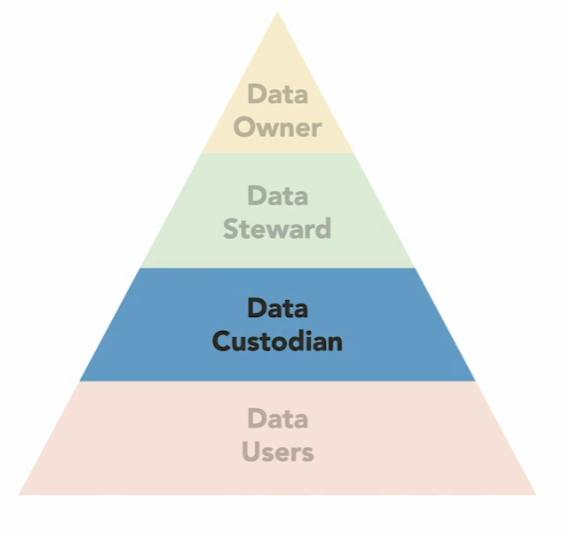

# Data Ownership/Roles

Primary information security roles include business or mission owners, data owners, system owners, custodians, and users. Each role has a different set of responsibilities in securing an organization's assets.

<figure><figcaption></figcaption></figure>

### BUSINESS OR MISSION OWNERS

Business owners and mission owners (senior management) create the information security program and ensure that it is properly staffed and funded, as well as given appropriate organizational priority. These owners are responsible for ensuring that all organizational assets are protected.

### DATA OWNERS

The data owner (also called information owner) is a manager responsible for ensuring that specific data is protected. Data owners determine data sensitivity labels and the frequency of data backup. They focus on the data itself, whether in electronic or paper format. A company with multiple lines of business may have multiple data owners. The data owner performs management duties, while custodians, which will be discussed shortly perform the hands-on protection of data.

### SYSTEM OWNER

The system owner is a manager who is responsible for the actual computers that house data. This includes the hardware and software configuration, including updates, patching, etc. The system owners ensure that the hardware is physically secure, operating systems are patched and up to date, the system is hardened, etc. Technical hands-on responsibilities are delegated to custodians, discussed in the next section.

### CUSTODIAN

A custodian provides hands-on protection of assets, such as data. They perform data backups and restoration, patch systems, configure antivirus software, etc. The custodians follow detailed orders and do not make critical decisions on how data is protected. The data owner may dictate, “The data owner may dictate that all data must be backed up every 24 h.” The custodians would then deploy and operate a backup solution that meets the data owner's requirements

### USERS

Users must follow the rules; they must comply with mandatory policies, procedures, standards, etc. For example, users must not write their passwords down or share accounts. Users must be made aware of these risks and requirements. They must also be made aware of the penalty for failing to comply with mandatory directives and policies.
